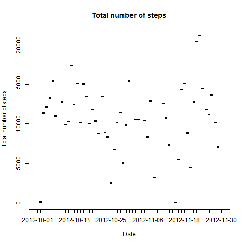
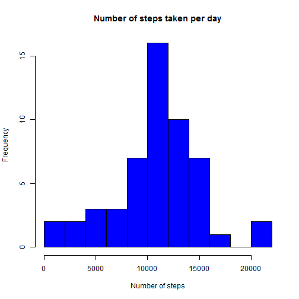
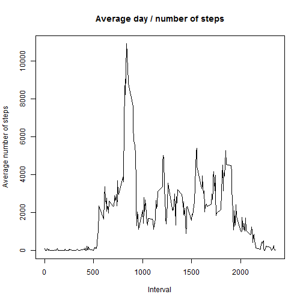
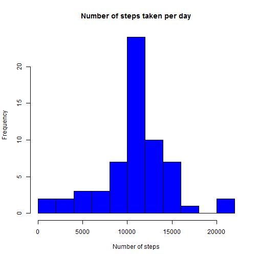
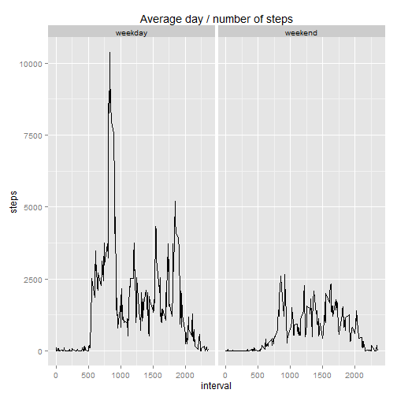

This is the R Markdown documentation of the results of the First Peer Assessement Project of
the Coursera-Course: The Data Scientist's Toolbox - Reproducible Research.


### Task 1: Loading and preprocessing the data

Loading of the input table "activity.csv" and pre-processing and transformation of the data for next tasks

```r
activity <- read.csv("activity.csv")
```
Create second table without NA-values for attribute "steps""

```r
activity_wo_na <- subset(activity, is.na(activity$steps) == FALSE)
```
Aggregation (sum and mean) of "steps"" by day or interval

```r
activity_agg_day <- aggregate(x = activity_wo_na$steps, by = list(activity_wo_na$date), FUN = "sum")
names(activity_agg_day)[1] <- "date"
names(activity_agg_day)[2] <- "steps"

activity_agg <- aggregate(x = activity_wo_na$steps, by = list(activity_wo_na$interval), FUN = "sum")
names(activity_agg)[1] <- "interval"
names(activity_agg)[2] <- "nr_steps"
```

### Task 2: What is mean total number of steps taken per day?

2.1.  Calculation of the total number of steps taken per day (preparation already done for Task 1); The series is:

```r
plot(activity_agg_day$date, activity_agg_day$steps, main= "Total number of steps", xlab = "Date", ylab = "Total number of steps")
```

 

2.2.  Creation of a histogram of the total number of steps taken each day

```r
hist(activity_agg_day$steps,col = "blue", main= "Number of steps taken per day", xlab = "Number of steps", breaks = 10)
```

 

2.3.  Calculation of mean and median of the total number of steps taken per day

```r
summary(activity_agg_day$steps)
```

```
##    Min. 1st Qu.  Median    Mean 3rd Qu.    Max. 
##      41    8841   10760   10770   13290   21190
```

### Task 3. What is the average daily activity pattern?

3.1.  Making of a time series plot of the 5-minute interval  and the average number of steps taken, averaged across all days

```r
plot(activity_agg$interval, activity_agg$nr_steps, type = "l", main= "Average day / number of steps", xlab = "Interval", ylab = "Average number of steps")
```

 

3.2.  Which 5-minute interval, on average across all the days in the dataset, contains the maximum number of steps?

```r
activity_agg$interval[activity_agg$nr_steps == max(activity_agg$nr_steps)]
```

```
## [1] 835
```


### Task 4. Imputing missing values

4.1.  Calculation of the total number of missing values in the dataset

```r
summary(activity$steps)
```

```
##    Min. 1st Qu.  Median    Mean 3rd Qu.    Max.    NA's 
##    0.00    0.00    0.00   37.38   12.00  806.00    2304
```

4.2.  Filling in all of the missing values in the dataset. The strategy uses the mean for that 5-minute interval

```r
activity_mean <- aggregate(x = activity_wo_na$steps, by = list(activity_wo_na$interval), FUN = "mean")
names(activity_mean)[1] <- "interval"
names(activity_mean)[2] <- "mean_steps"

activity_imputed <- merge(activity, activity_mean, by.x="interval", by.y="interval", all=TRUE)
```

4.3.  Creation of a new dataset that is equal to the original dataset but with the missing data filled in     

```r
activity_imputed$steps[is.na(activity_imputed$steps)] <-  subset(activity_imputed, is.na(activity_imputed$steps) == TRUE)$mean_steps

activity_agg_day_imp <- aggregate(x = activity_imputed$steps, by = list(activity_imputed$date), FUN = "sum")
names(activity_agg_day_imp)[1] <- "date"
names(activity_agg_day_imp)[2] <- "steps"
```

4.4.  Making a histogram of the total number of steps taken each day and calculation of the mean and median total number of steps taken per day

```r
hist(activity_agg_day_imp$steps,col = "blue", main= "Number of steps taken per day", xlab = "Number of steps", breaks = 10)
```

 

```r
summary(activity_agg_day_imp$steps)
```

```
##    Min. 1st Qu.  Median    Mean 3rd Qu.    Max. 
##      41    9819   10770   10770   12810   21190
```

Do these values differ from the estimates from the first part of the assignment? (Review of old results)

```r
summary(activity_agg_day$steps)
```

```
##    Min. 1st Qu.  Median    Mean 3rd Qu.    Max. 
##      41    8841   10760   10770   13290   21190
```
Answer: Mean stays the same whereas the median increases by 10 steps per day

### Task 5. Are there differences in activity patterns between weekdays and weekends?

5.1.  Creation of a new factor variable in the dataset with two levels - "weekday" and "weekend" indicating whether a given date is a weekday or weekend day

```r
activity_imputed$day <- weekdays(as.Date(activity_imputed$date)) 
activity_imputed$daytype[substr(activity_imputed$day, 1 ,1) == 'S'] <- "weekend"
activity_imputed$daytype[substr(activity_imputed$day, 1 ,1) != 'S'] <- "weekday"
```

5.2.  Creation of a panel plot containing a time series plot of the 5-minute interval and the average number of steps taken, averaged across all weekday days or weekend days   

```r
activity_agg2 <- aggregate(x = activity_imputed$steps, by = list(activity_imputed$interval, activity_imputed$daytype), FUN = "sum")
names(activity_agg2)[1] <- "interval"
names(activity_agg2)[2] <- "daytype"
names(activity_agg2)[3] <- "steps"

library(ggplot2)
ggplot(activity_agg2, aes(x = interval, y = steps)) + 
  geom_line() + 
  facet_wrap(~daytype, nrow = 1) + 
  labs(title = "Average day / number of steps")
```

 

That's all! The file is ending here.
